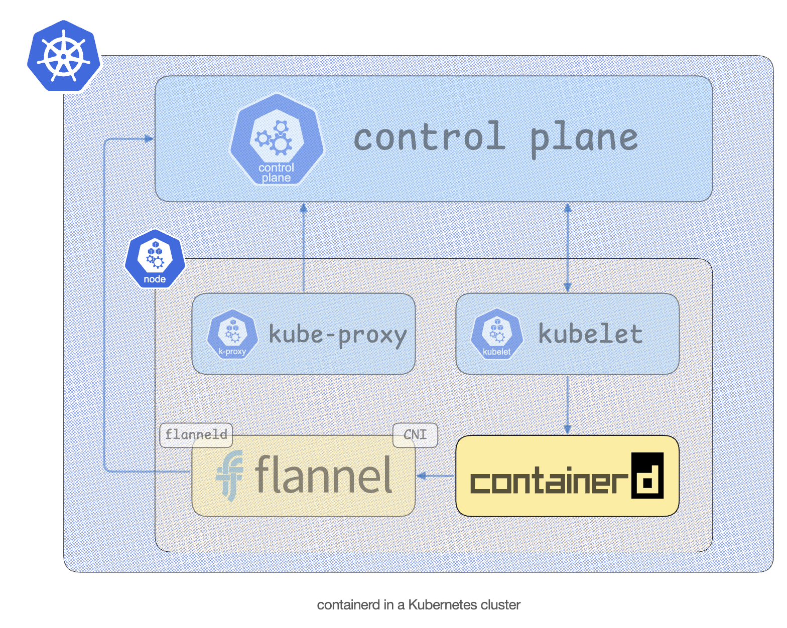
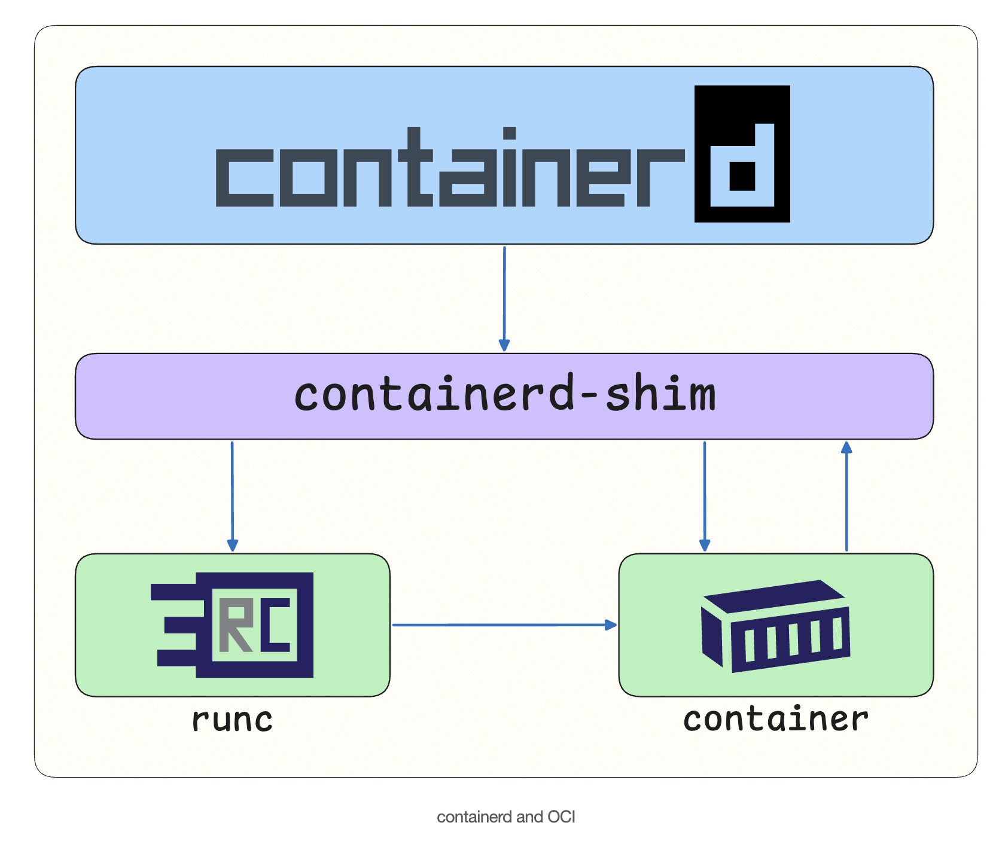
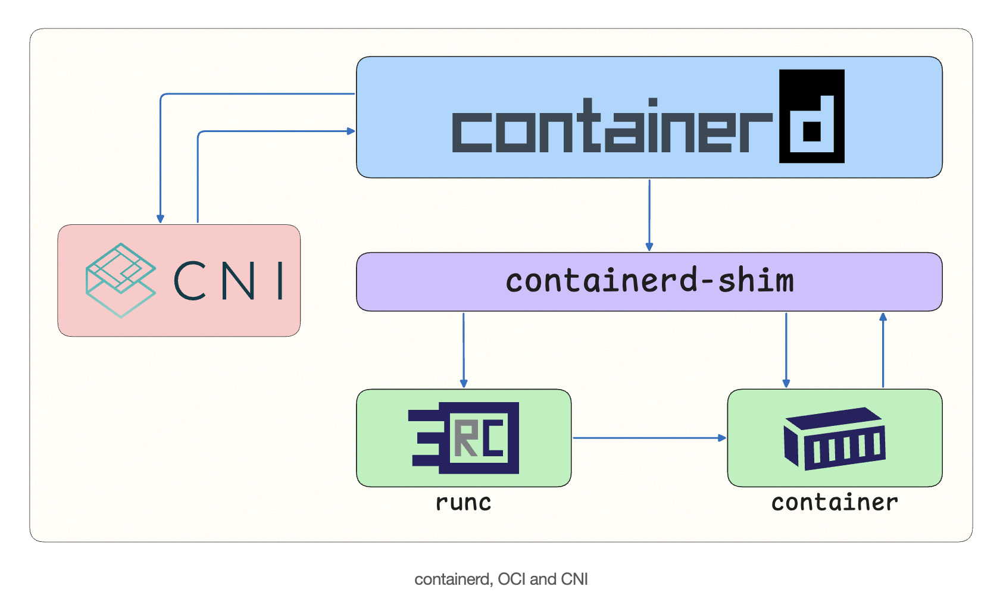
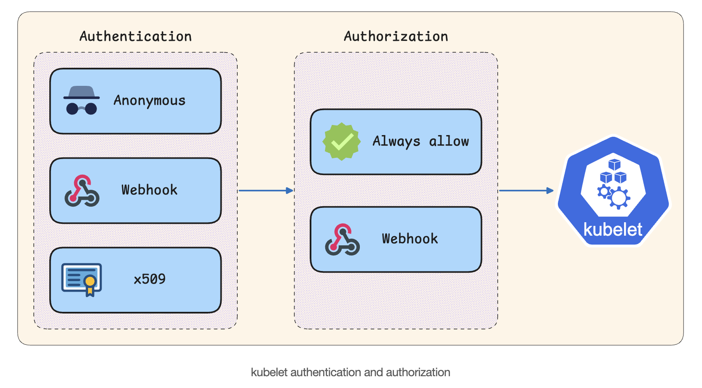

# containerd

- containerd is an industry-standard container runtime that provides the fundamental tools for running containers.
- Originally developed by Docker, containerd is now maintained by the CNCF and has become one of the most widely adopted container runtimes in the cloud-native ecosystem.
- containerd provides several essential services to Kubernetes:
    - **Container Lifecycle Management**: Creating, starting, stopping, and deleting containers
    - **Image Management**: Pulling, storing, and managing container images from registries
    - **Storage Management**: Handling container filesystems and volume mounts
    - **Network Management**: Coordinating with CNI plugins for container networking
    - **Runtime Management**: Interfacing with low-level runtimes

## containerd in k8s


### Download and install containerd:

#### Download and install containerd:

```
CONTAINERD_VERSION=2.2.1

curl -fsSLO "https://github.com/containerd/containerd/releases/download/v${CONTAINERD_VERSION?}/containerd-${CONTAINERD_VERSION?}-linux-amd64.tar.gz"

sudo tar xzvofC "containerd-${CONTAINERD_VERSION?}-linux-amd64.tar.gz" /usr/local
```

#### Download the systemd unit file to run containerd as a systemd service:
```
sudo wget -P /etc/systemd/system "https://raw.githubusercontent.com/containerd/containerd/v${CONTAINERD_VERSION?}/containerd.service"

```

#### Start the containerd service:
```
sudo systemctl daemon-reload
sudo systemctl enable --now containerd

```

### Interacting with conatinerd

- **containerd includes a CLI tool called ctr for basic container operations.**
```
sudo ctr images pull ghcr.io/sagikazarmark/docker-hello-world:latest
```
- With the image pulled, you can run the container:
```
sudo ctr run --rm ghcr.io/sagikazarmark/docker-hello-world:latest hello
```

### Installing an OCI Runtime

- **containerd** is a high-level container runtime that provides a wide range of container management services (like image management, storage, and networking), 
- but delegates certain tasks to specialized components. One such task is actually running the container process, which containerd delegates to a **low-level OCI runtime**.



- **Conatinerd-shim** - The containerd-shim is a lightweight process that acts as a **bridge** between **containerd and OCI runtimes**.
- It provides a **stable interface** for containerd **to interact with the runtime**, **keeps containers running even if containerd crashes, handles container I/O, and reaps processes when they exit**.

- **Runc** - runc is a CLI tool for spawning and running containers on Linux according to the OCI specification.

#### Download and install Runc:
```
RUNC_VERSION=v1.4.0

curl -fsSLO "https://github.com/opencontainers/runc/releases/download/${RUNC_VERSION?}/runc.amd64"

sudo install -m 755 runc.amd64 /usr/local/sbin/runc

```
#### Configure containerd to use the systemd cgroup driver with runc:

- Make the required directory (if not)
```
sudo mkdir -p /etc/containerd
sudoedit /etc/containerd/config.toml
```
- Configure the conatinerd to use systemd cground with runc
    - **cgroups (control groups)** limit and isolate resource usage (CPU, memory, I/O) for container processes.
    - When using systemd as the init system, it's recommended to use the systemd cgroup driver **so both systemd and the container runtime manage cgroups consistently.**
    - This **ensures the container runtime and systemd coordinate through a single cgroup hierarchy, rather than managing resources separately, which can cause instability under memory or CPU pressure**.
```
version = 3

[plugins."io.containerd.cri.v1.runtime".containerd.runtimes.runc.options]
SystemdCgroup = true
```

- Restart the containerd
```
sudo systemctl restart containerd
```

- Run the conatiner now:
```
sudo ctr run --rm ghcr.io/sagikazarmark/docker-hello-world:latest hello
```

### Interacting with NerdCtl

#### Download and install nerdctl:

```
NERDCTL_VERSION=2.2.1

curl -fsSLO "https://github.com/containerd/nerdctl/releases/download/v${NERDCTL_VERSION?}/nerdctl-${NERDCTL_VERSION?}-linux-amd64.tar.gz"

tar xzvof "nerdctl-${NERDCTL_VERSION?}-linux-amd64.tar.gz"

sudo install -m 755 nerdctl /usr/local/bin

nerdctl completion bash | sudo tee /etc/bash_completion.d/nerdctl

```
#### Verify by running container

```
sudo nerdctl run --rm ghcr.io/stefanprodan/podinfo:latest /home/app/podinfo --version
```

**Above will fail with an error**
```
FATA[0005] failed to verify networking settings: failed to create default network: needs CNI plugin "bridge" to be installed in CNI_PATH ("/opt/cni/bin"), see https://github.com/containernetworking/plugins/releases: exec: "/opt/cni/bin/bridge": stat /opt/cni/bin/bridge: no such file or directory 
laborant@ubuntu-01:~$ 
```

#### Temporary Workaround

**Never try in production always use CNI plugins**

```
sudo nerdctl run --net host --rm ghcr.io/stefanprodan/podinfo:latest /home/app/podinfo --version
```

### Installing CNI Plugins



#### Download and install CNI plugins:
```
CNI_PLUGINS_VERSION=v1.9.0

curl -fsSLO "https://github.com/containernetworking/plugins/releases/download/${CNI_PLUGINS_VERSION?}/cni-plugins-linux-amd64-${CNI_PLUGINS_VERSION?}.tgz"

sudo mkdir -p /opt/cni/bin

sudo tar xzvofC "cni-plugins-linux-amd64-${CNI_PLUGINS_VERSION?}.tgz" /opt/cni/bin
```

- Above 💡 CNI plugins are installed in `/opt/cni/bin` by convention.
- Container runtimes and Kubernetes network add-ons look for them in this directory by default.
---

#### Run the container again using nerdctl:
```
sudo nerdctl run -d --name podinfo ghcr.io/stefanprodan/podinfo:latest
```

#### Verify that the container is running:
```
sudo nerdctl ps
```

#### Verify that podinfo is working correctly:

```
PODINFO_IP=$(sudo nerdctl inspect --format '{{ .NetworkSettings.IPAddress }}' podinfo)
curl -f "http://${PODINFO_IP}:9898"
```

# Kubelet

kubelet is the primary node agent that runs on every worker node in a Kubernetes cluster. As one of the core components that makes Kubernetes work, it acts as the bridge between the Kubernetes control plane and the container runtime on each node.

kubelet operates in a continuous reconciliation loop:

- **Watches** for Pod specifications from the API server
- **Compares** the desired state (what should be running) with the actual state (what is running)
- **Takes action** to bring the actual state in line with the desired state
- **Reports** the current status back to the control plane

## Download and install kubelet:

```
KUBE_VERSION=v1.34.0

curl -fsSLO "https://dl.k8s.io/${KUBE_VERSION?}/bin/linux/amd64/kubelet"

sudo install -m 755 kubelet /usr/local/bin
```

## Download the systemd unit file for kubelet:

```
sudo wget -O /etc/systemd/system/kubelet.service https://labs.iximiuz.com/content/files/courses/kubernetes-the-very-hard-way-0cbfd997/02-worker-node/02-kubelet/__static__/kubelet.service?v=1777378794
```

## Configure the kubelet
```
sudo mkdir -p /var/lib/kubelet/config.d
sudoedit /var/lib/kubelet/config.d/99-cri.conf
```

```
apiVersion: kubelet.config.k8s.io/v1beta1
kind: KubeletConfiguration

containerRuntimeEndpoint: unix:///var/run/containerd/containerd.sock
cgroupDriver: systemd
```

## Start the kubelet
```
sudo systemctl daemon-reload
sudo systemctl enable --now kubelet
```

## Kubelet API

- kubelet exposes an HTTP API endpoint (typically on port 10250) that allows the Kubernetes API server and other components to interact with it.

This endpoint provides access to:
- Pod logs and exec sessions
- Node metrics and health information

Normally, this endpoint is secured using TLS and authentication/authorization mechanisms. However, for the purposes of this lesson, you will disable authentication and authorization to simplify the setup.



### Configure kubelet to disable authentication and authorization:

**⚠️ Do NOT disable authentication and authorization in production environments.**

Configure kubelet to disable authentication and authorization:

```
apiVersion: kubelet.config.k8s.io/v1beta1
kind: KubeletConfiguration

authentication:
  anonymous:
    enabled: true
  webhook:
    enabled: false

authorization:
  mode: AlwaysAllow
```

#### Restart the kubelet

`sudo systemctl restart kubelet`

#### Verify the running kubelet

`curl -k https://localhost:10250/healthz`

## Static Pods

- Static Pods are Pods managed directly by kubelet on a specific node rather than by the Kubernetes API server.
- Unlike regular Pods that are created and managed through the cluster's control plane, static Pods are defined by placing Pod manifest files in a directory that kubelet monitors.
- When kubelet finds a Pod manifest in the static Pod directory, it automatically creates and manages that Pod. If the Pod crashes or stops, kubelet automatically restarts it (through the container runtime).
- Kubelet also creates a mirror Pod in the Kubernetes API server for each static Pod. This mirror Pod allows you to see the static Pod when you run kubectl get pods, but you cannot control the static Pod through the API server: only kubelet can manage it directly.

**⚠️ Due to their nature, static Pods cannot reference other Kubernetes API objects like Secrets, ConfigMaps, or ServiceAccounts.**

**They can only use resources available directly on the node, such as hostPath or emptyDir volumes.**

### configure the static Pods
```
sudoedit /var/lib/kubelet/config.d/50-static-pods.conf
apiVersion: kubelet.config.k8s.io/v1beta1
kind: KubeletConfiguration

staticPodPath: /etc/kubernetes/manifests
```
### Restart the kubelet service to apply the configuration changes:

`sudo systemctl restart kubelet`

### Create Static Pod

```
sudoedit /etc/kubernetes/manifests/podinfo.yaml

apiVersion: v1
kind: Pod
metadata:
  name: podinfo
spec:
  hostNetwork: true
  containers:
    - name: podinfo
      image: ghcr.io/stefanprodan/podinfo:latest
      ports:
        - containerPort: 9898
```

#### Verify Static Pod Running:

`curl -sfk https://localhost:10250/pods | jq '.items[0].metadata'`
`curl http://localhost:9898 | jq` - verify application is running successfully

### Note:
- Though application is running but static pods are not visible, when you list container 
    - `sudo nerdctl ps`
- This happens because containerd organizes containers into namespaces (similar to Kubernetes), and Kubernetes uses the k8s.io namespace by default.
    - `sudo ctr namespace ls`
- Now, put namespaces while listing container and you will be able to see the conatiner
    - `sudo nerdctl ps --namespace k8s.io`

## Glossary:
- CTR 
    - Containerd includes a CLI tool called ctr for basic container operations. 
    - An excellent tool for low-level interaction with containerd, it isn't the most user-friendly tool, especially for users familiar with the Docker CLI.
    - Unlike ctr, nerdctl automatically handles image pulling and network setup.
- Nerdctl
    - While ctr doesn't automatically create a network for containers, nerdctl attempts to create a bridge network by default.


